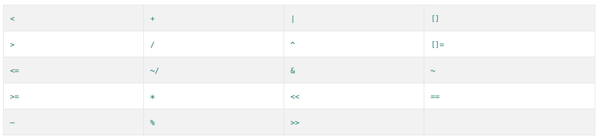

# [操作符 ( Operators )](https://www.dartlang.org/guides/language/language-tour#operators)

## 算数运算符 ( Arithmetic operators )

其中大部分算数运算符都与其它语言类似(除了 / 和 ~/) ，这两个都是除运算，前者的返回类型是 double ，后者返回的是 int 类型。

操作符|说明|
-------|-------
+		|加运算
-		|减运算
-expr	|一元反转表达符号
*		|乘运算
/		|除运算 返回 double 类型
~/		|除运算，返回 int 类型
%		|模数运算  获取余数
++var	|等价于 var = var + 1 (expression value is var + 1)
var++	|等价于 var = var + 1 (expression value is var)
--var	|等价于 var = var – 1 (expression value is var – 1)
var--	|等价于 var = var – 1 (expression value is var)

示例代码：

```
main() {
  _add();
  _subtract();
  _reverseExpression();
  _multiply();
  _divide();
  _divideReturnIntegerResult();
  _modulo();
  _prefixAndPostfix();
}

/// +	Add   加运算
_add() {
  assert(1 + 1 == 2);
}

/// –	Subtract    减运算
_subtract() {
  assert(3 - 1 == 2);
}

/// -expr	Unary minus, also known as negation (reverse the sign of the expression)    一元反转表达符号
_reverseExpression() {
  assert(1 - 2 == -1);
}

/// *	Multiply    乘运算
_multiply() {
  assert(2 * 3 == 6);
}

/// /	Divide    除运算 返回double
_divide() {
  assert(5 / 2 == 2.5);
}

/// ~/	Divide, returning an integer result //除运算，返回整数
_divideReturnIntegerResult() {
  assert(5 ~/ 2 == 2);
}

/// %	Get the remainder of an integer division (modulo) 模数运算  获取余数
_modulo() {
  assert(5 % 2 == 1);
}

/// ++ -- 前缀或后缀表使用
_prefixAndPostfix() {
  var val = 1;
  var x = ++val; //x = 2，先加再赋值
  assert(x == 2);

  val = 1;
  x = val++; //x = 1，先赋值再加
  assert(x == 1);

  val = 1;
  x = --val; //x = 0，先减再赋值
  assert(x == 0);

  val = 1;
  x = val++; // x = 1，先赋值再减
  assert(x == 1);
}
```

[arithmeticOperators.dart 代码](../../dart/operators/arithmeticOperators.dart)

## 关系运算符 ( Equality and relational operators )

Dart 提供的关系运算符与其它语言没区别。

操作符|说明|
-------|-------
==		|相等
!=		|不相等
\>		|大于
<		|小于
\>=		|大于等于
<=		|小于等于

示例代码：

```
main() {
  //直接Copy官方源码
  assert(2 == 2);
  assert(2 != 3);
  assert(3 > 2);
  assert(2 < 3);
  assert(3 >= 3);
  assert(2 <= 3);

  var x;
  var y;
  var c = 1;

  assert(x == y);//两个null使用 ==，结果返回true
  assert(x != c);//两个其中一个为null，结果返回false
}
```

[equalityAndRelationalOperators.dart 代码](../../dart/operators/equalityAndRelationalOperators.dart)

## 类型判断符 ( Type test operators )

类型判断符是在运行时进行类型检查。

操作符|说明|
-------|-------
as		|类型转换操作符
is		|判断类型是否为指定类型
is!		|判断类型是否不为指定类型

```
main(){
  Object i = 255;

  //使用as 进行类型强转
  print((i as int).toRadixString(16).toUpperCase());//打印：FF

  if(i is int){
      //这里使用is 判断类型后，该代码段已经隐式转换了
      print(i.toRadixString(16).toUpperCase());//打印：FF
  }

  print(i is int);//打印：true
  print(i is! String);//打印：true

  Object xy = "xy";
//  print(xy as int);//运行时错误，xy不能强转为int类型，会抛出异常 type 'String' is not a subtype of type 'int' in type cast
}
```

[typeTestOperator.dart 代码](../../dart/operators/typeTestOperator.dart)

> is 判断符在 if 判断为 true 时，代码块中的类型会被隐式转换，可直接使用。

## 赋值运算符 ( Assignment operators )

Dart 可以使用赋值运算符指定值，除 ‘ = ’ 外其它都是符合赋值操作符。

操作符|说明|
-------|-------
=		|赋值
–= <br> /= <br> %= <br> \>>= <br> ^= <br> += <br> *= <br> ~/=	 <br> <<=	 <br> &= <br> \|= |复合赋值操作符

示例代码：

```
///                         复合赋值操作符    拆分赋值操作符
///   For an operator op:	a op= b	         a = a op b
///   Example:              a += b	         a = a + b
main() {
  double a = 3; //  =
  a -= 1; //  -=    拆分：a = a - 1
  print(a);//打印：2.0

  a /= 2; //  /=    拆分：a = a / 2
  print(a);//打印：1.0

  a %= 2; //  %=    拆分：a = a % 2
  print(a);//打印：1.0
  ……  
}
```

[assignmentOperator.dart 代码](../../dart/operators/assignmentOperator.dart)

## 逻辑运算符 ( Logical operators )

逻辑运算符 作用是颠倒或组合 boolean类型表达式。

操作符|说明|
-------|-------
!expr	|非运算
\|\|	|或运算
&&		|与运算

示例代码：

```
main(){
  bool result1 = true;
  bool result2 = false;

  //非运算 颠倒
  print(!result1);//打印：false
  // 或运算  组合
  print(result1 && result2);//打印：false
  // 与运算  组合
  print(result1 || result2);//打印：true
}
```
[logicalOperator.dart 代码](../../dart/operators/logicalOperator.dart)

## 位运算符 ( Bitwise and shift operators )

操作符|说明|
-------|-------
&		|与运算
\|		|或运算
^		|异或运算
~expr	|一元位补码
<<		|左位移
\>>		|右位移

示例代码：

```
main(){
  //这段代码Copy自官网
  final value = 0x22;
  final bitmask = 0x0f;

  assert((value & bitmask) == 0x02); // AND
  assert((value & ~bitmask) == 0x20); // AND NOT
  assert((value | bitmask) == 0x2f); // OR
  assert((value ^ bitmask) == 0x2d); // XOR
  assert((value << 4) == 0x220); // Shift left
  assert((value >> 4) == 0x02); // Shift right

  //Copy End Line

  print((bitmask).toRadixString(2));//打印：1111

  //一元位补码2进制打印
  print(value.toRadixString(2));//打印：100010
  print((~bitmask).toRadixString(2));//打印：-10000
  print((value & ~bitmask).toRadixString(2));//打印：100000
}
```

[bitwiseAndShiftOperator.dart 代码](../../dart/operators/bitwiseAndShiftOperator.dart)

## 条件表达式 ( Conditional expressions )

Dart 提供两个操作符可以用于替换if-else的写法。

操作符|说明|
-------|-------
condition ? expr1 : expr2| 如果 condition 为 true <br> 返回 expr1 的值，否则返回 expr2 的值
expr1 ?? expr2| 如果 expr1 为 null，返回 expr2 的值，否则返回自身

示例代码：

```
main() {
  //condition ? expr1 : expr2
  const condition = true;
  String result = condition ? "expr1" : "expr2";//如果 condition 为 true ,返回 expr1，否则返回 expr2
  print(result);//打印：expr1

  //expr1 ?? expr2
  var name;
  result = name ?? "expr2";//这里 name 为 null，result 的值为 expr2
  print(result);//打印：expr2

  name = "Dart2";
  result = name ?? "expr2";//这里 name 不为 null，result 的值未 Dart2
  print(result);//打印：Dart2
}
```

[conditionalExpressionsOperator.dart 代码](../../dart/operators/conditionalExpressionsOperator.dart)

## 级联符 ( Cascade notation )

我相信很多人都使用 Java 写过建造者模式的代码，让函数返回当前对象来达到我们链式调用的目的，但会给编码造成额外的负担。

现在 Dart 为我们提供了级联操作符 ( .. ) 来解决了这个问题，严格意义上来说，它不算是一个操作符，而是 Dart 的句法。它会忽略函数的返回值，继续使用原对象进行操作。

示例代码：

```
main() {
  var sb = StringBuffer();
//  sb.write('foo')//write返回类型为void
//    ..write('bar'); //编译错误，void 类型不能作为级联对象

  ////使用级联操作符正确的姿势
  sb..write("Dart2 ")
    ..write("Flutter ")
    ..write("Android ")
    ..write("Java ")
    ..write("So ")
    ..write("Easy!");

  print(sb.toString()); //打印：Dart2 Flutter Android Java So Easy!

  //使用级联操作符后，函数返回值会被忽略。
  var cascadeNotation = new CascadeNotation()
    ..name.toUpperCase().substring(0, 1)
    ..name;
  print(cascadeNotation.runtimeType); //打印：CascadeNotation
}

class CascadeNotation {
  String name = "Dart";
}
```

[cascadeNotationOperator.dart 代码](../../dart/operators/cascadeNotationOperator.dart)

## 其它操作符 ( Other operators )

操作符|名称|说明
-------|-------|-------
()		| 函数应用	|表示调用函数
[]		| 列表访问	|引用在列表中指定下标的值
.		| 成员访问	|引用成员属性或函数
?.		| 条件表达式的成员访问|空安全操作符，操作符左边的对象不为空则会执行成员访问

## 重载运算符 ( Overridable operators )

Dart 支持许多操作符的重载，这个特性可能会造成阅读代码的歧义，如果重载代码质量不高或出现 Bug，可能很难排查出问题所在,不宜维护，请慎用该特性。

支持覆盖的操作符：



示例代码：

```
main() {
  //重载操作符
  final v = Vector(2, 3);
  final w = Vector(2, 2);

  final vv = v + w;
  final ww = v - w;

  print(vv.toString());//打印：Vector{x: 4, y: 5}
  print(ww.toString());//打印：Vector{x: 0, y: 1}

  assert(v + w == Vector(4, 5));
  assert(v - w == Vector(0, 1));
}

///扩展操作符 参考官方网站
class Vector {
  final int x, y;

  Vector(this.x, this.y);

  ///重载 + 运算操作符
  Vector operator +(Vector v) => Vector(x + v.x, y + v.y);

  ///重载 - 运算操作符
  Vector operator -(Vector v) => Vector(x - v.x, y - v.y);

  @override
  String toString() {
    return 'Vector{x: $x, y: $y}';
  }

  /// 重载 == 运算操作符，重载该操作符同时也应该重写hashCode
  @override
  bool operator ==(other) {
    if (other is! Vector) {
      return false;
    }
    return x == other.x && y == other.y;
  }
}
```

[extendingClass.dart 代码](../../dart/classes/extendingClass.dart)


## 分类

官方对操作符做了如下分类，在这里搬运一下。

操作符|说明|
-------|-------
一元后缀 ( unary postfix )		|expr++    expr--    ()    []    .    ?.
一元前缀 ( unary prefix )		|-expr    !expr    ~expr    ++expr    --expr   
乘除取余 ( multiplicative )		|*    /    %  ~/
加减 ( additive )					|+    -
位移 ( shift )					|<<    >>    >>>
位与 ( bitwise AND )				|&
位异或 ( bitwise XOR )			|^
位或 ( bitwise OR )				|\|
关系或类型实验 ( relational and type test ) |>=    >    <=    <    as    is    is!
相等 ( equality )					|==    !=   
逻辑与 ( logical AND )			|&&
逻辑或 ( logical OR )			|\|\|
空判断 ( if null )				|??
条件表达式 ( conditional )		|expr1 ? expr2 : expr3
级联 ( cascade )					|..
赋值 ( assignment )				|=    *=    /=   +=   -=   &=   ^=   